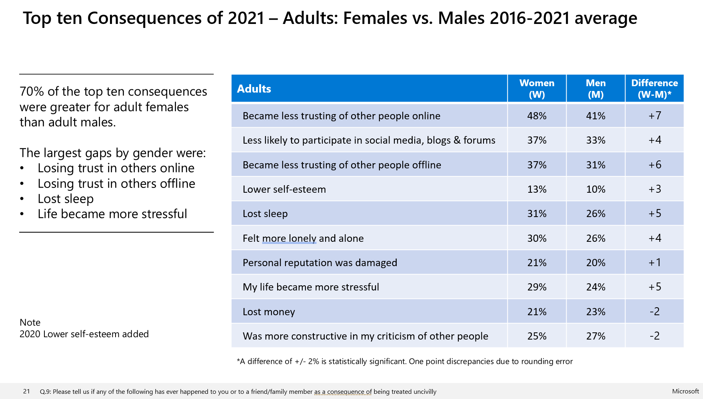

# Microsoft releases Digital Civility Index data set disaggregated by gender, highlighting the risks faced by teen girls and women online  

As part of [international Safer Internet Day](https://www.saferinternetday.org/), Microsoft released the sixth annual study on Digital Civility around the world. For the first time,  since the Digital Civility report has been conducted Microsoft is releasing on the gender-disaggregated data set that underpins the studyfrom all six years of the study. 

 Most notably, while this year’s report finds that overall online civility improved, when disaggregated by gender, the data shows that teen girls and women experienced an all-time high of online risk and negative experiences since the study began in 2016.  

**_Microsoft on disaggregated data by gender at the Generation Equality Forum_**

While data plays an increasingly important role in our lives, access to quality data on gender has lagged behind. Data that utilizes gender as a primary marker reflects different lived experiences related to gender. That’s why for the first time since Microsoft launched its Digital Civility Index research, we’ve decided to make public the data that underpins the research.

As a private sector leader for the [Generation Equality Forum’s action coalition on Innovation and Technology](https://blogs.microsoft.com/on-the-issues/2021/07/01/human-centered-connectivity-un-generation-equality-forum/) Microsoft recognizes the importance of advocating for and advancing the release of gender disaggregated data to realize gender equality and to [close the data divide](https://news.microsoft.com/opendata/). Microsoft hopes publishing the data set will spur similar research and releases from other companies, partners, and institutions and advance better gender data policies and solutions. 

**_Digital civility, safety, and interaction online_**

Since 2016, Microsoft has been surveying teens and adults around the world about the state of digital civility. A total of over 70,000 respondents from 34 different countries have participated in the survey over six years. The line-up of countries varied each year with an average of 23 countries participating in the annual survey.   

The latest survey, “Civility, Safety and Interaction Online – 2021”, polled teens and adults about their exposure to 21 online risks across four categories (reputational, behavioural, sexual, and personal/intrusive), their experiences online, including COVID-19 impacts, and how these risks and experiences shape their views of life online.

For more information on the wider study results visit our [Digital Civility website](https://www.microsoft.com/en-us/online-safety/digital-civility).

<h2>Disaggregated data shows teen girls and women experience greater online risks than males</h2>

Over the past six years, results from the Digital Civility study have shown that teen girls and women have more online negative experiences than males and suffer greater negative emotional, physical, and psychological consequences. 

This year’s report finds that while overall online civility improved, teen girls and women experienced almost 60% of all risks online, an all-time high. Females were more likely to experience misogyny, unwanted sexual attention, unwanted contact, sexual solicitation, and online harassment. These risks are especially true among teen girls.  

At the same time, males’ experiences online improved. For example, teen boy and men respondents reported a decrease from last year’s numbers in trolling, unwanted sexting, and hate speech. 

<h2>Key findings from the 2021 research</h2>

**Females experience more risks online than males:**

•	The share of consequences for females online has steadily increased since 2018 and stands at an all-time high of almost 60%
 
•	On average, females scored 8-points higher on severe to unbearable pain compared to males
 
•	As a result of common online risks, teen girls and women are significantly more likely to lose trust in others online, have lowered self-esteem, and lost sleep; this gap was especially pronounced between teen girls and boys 

**Online behaviour changes during Covid-19:**

•	Since 2020, there was a 9-point increase among females who said experiences online were worse due to the pandemic, compared to only a 3-point increase by males 

•	Female respondents reported more instances of unwanted sexual attention during the pandemic and with an increase twice as large than males’  

•	Both genders registered double-digit increases in reports of damage to personal reputation and a reduction in social media usage

**Attitudes and confidence in managing online risks:**

•	Only 44% of females report feeling confident in their ability to manage online risks. This was 14-points lower than males 

•	Females more strongly believed in addressing the problems of online risks including education, reducing the ability to post anonymously, and policing of social media platforms 

 
 

 

 
A more complete analysis of gender differences can be found in [Gender Difference in Civility Safety & Interaction Online 2016-2021](Gender Difference in Civility Safety & Interaction Online 2016-2021.pdf)
 
<h2> Methodology and Data Set</h2>

The enclosed data set includes over 60,000 responses from 22 countries that participated in at least four years of the research, allowing researchers a longitudinal view of respondents’ internet experiences in these different geographies. The "data" folder includes the data set in CSV format, along with an "inventory" CSV detailing each of the variables and values in the dataset. 
 
The study design called for sampling 500 respondents per country within each wave, equally balanced between 250 teens (ages 13-17) and 250 adults (ages 18-74). Additional adult age quotas were set to ensure the respondent mix reflected the internet user population within each country.  Gender quotas were also set to ensure similar representation of both males and females within each age group.

The dataset contains 120 variables including basic respondent demographics (age, gender, country) along with key questions repeated across multiple waves. Note that select countries were not represented across all 6 waves, and items changed slightly over time, so not every response item is found in all 6 waves.

Key topics/variables in the dataset include:

•	**Online Risks Encountered** (Q2A_Doxing to Q2U_unwanted sexual attention) Twenty one risk items asking respondents whether they encountered specific types of internet incivility

•	**Risk Sources** (Q2ar1_risk_source to Q2axnone) Who were the sources of uncivil behavior that respondents encountered 

•	**Pain experienced** (Q5_1A_pain to Q5_1U) How much pain was caused by any specific risks respondents experienced in Q2. _Asked for up to 5 randomly selected risks a given user experienced_.

•	**MaxPain** What was the highest level of pain/discomfort experienced from any online risk

•	**Recency of risk** (Q6A_most_recent to Q6U) When was the last time the risk was experienced

•	**Consequences of risks** (Q9r2_consiquences to Q9r25) What consequences were experienced as a result of online incivility

•	**Actions taken in response to online risks** (Q12r1_actions_taken to Q12r22) 

•	**WW_Weight** a weighting variable which exactly balances out males and females within adult and teen quotas in each country. Useful for comparisons between groups or waves when the unweighted number of males vs females may be different.

A complete list of all individual variables and their value labels is found in the [Data File Inventory](Data/Data File Inventory.csv)
